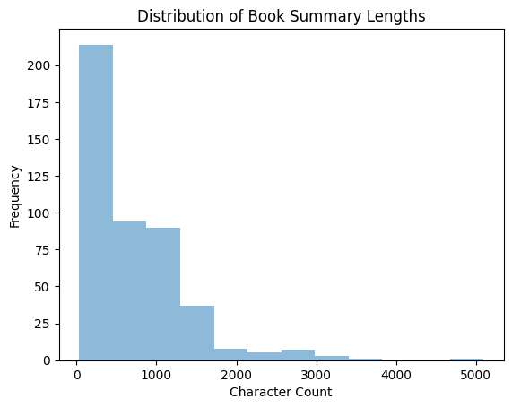
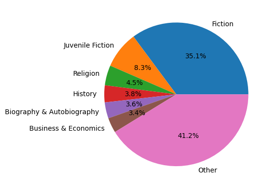
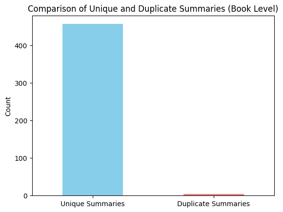
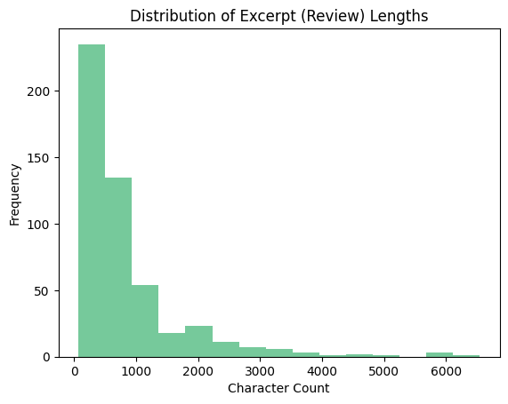

<div align="center">

# 📚 BookLens

### Sentiment Analysis and Theme Discovery in Book Reviews

*A small, reproducible NLP pipeline built on Chapters 4–5 of* Hands-On Large Language Models *(Alammar & Grootendorst) — pretrained sentiment classification, a classical baseline, and BERTopic-style theme discovery, joined into one analysis table.*


</div>

---

## 1. Problem Statement

Given a table of books (metadata, summaries, and short review excerpts), can a
**pretrained** sentiment classifier — never fine-tuned on book language —
reliably tell positive reviews from negative ones? And separately, does an
**unsupervised** clustering pipeline over book *summaries* discover themes
that a human would recognize as coherent genres, rather than statistical
noise?

BookLens answers both questions on the same small dataset and then joins the
two outputs to ask a third: do certain themes skew more positive, and which
books don't fit cleanly into any discovered theme?

**Explicitly out of scope:** fine-tuning BERT, RAG, LangChain, training a
custom embedding model, or a generative topic-labeling agent — see the
project guide's Scope Boundary.

## 2. Dataset & Provenance

Source data comes from the Kaggle CSV mirror
[`mohamedbakhet/amazon-books-reviews`](https://www.kaggle.com/datasets/mohamedbakhet/amazon-books-reviews)
(book metadata + user review text), not raw academic `.json.gz` files — see
[`data/README.md`](data/README.md) for the full schema mapping, download
command, and a breakdown of which files in `data/` are committed vs.
git-ignored.

Working sample: **220 books, up to 5 reviews each → 748 excerpt rows**
(`src/config.py`: `N_BOOKS=220`, `EXCERPTS_PER_BOOK=5`, `SAMPLE_SEED=42`).

## 3. Data Cleaning Decisions

`src/data.py` keeps cleaning conservative — the goal is removing noise
without rewriting anyone's actual words:

- Collapse repeated whitespace / newlines (`" ".join(text.split())`)
- Unescape HTML entities (`&amp;` → `&`, etc.)
- Drop rows where `summary` or `excerpt` is empty *after* cleaning
- Parse the Kaggle `categories` column (a stringified Python list, e.g.
  `"['Fiction']"`) down to a single `genre_clean` label via `ast.literal_eval`,
  so every downstream step — EDA, topic prep, final analysis — shares one
  genre column instead of three separate re-derivations of it

Four EDA plots (`make_eda_plots()`, capped at exactly 4 per the Lean scope),
regenerated here from the small redistributable `data/sample_books.csv`
preview so they render without needing the full Kaggle download:

<table>
<tr>
<td></td>
<td></td>
</tr>
<tr>
<td></td>
<td></td>
</tr>
</table>

## 4. Sentiment Model & Gold-Set Evaluation

| | |
|---|---|
| **Model** | [`finiteautomata/bertweet-base-sentiment-analysis`](https://huggingface.co/finiteautomata/bertweet-base-sentiment-analysis) |
| **Training domain** | Twitter (short, informal text) — a deliberate domain mismatch against book reviews, which is exactly what the gold-set evaluation is designed to test |
| **Classes** | `NEG` / `NEU` / `POS`, all three scores kept (`top_k=None`), not just the winning label |
| **Inference (recorded run)** | 748 excerpts in 10.49s |

An 80-excerpt **gold set** was sampled with `sample_gold_candidates()` —
balanced across rating buckets *and* the model's own uncertain predictions
(max class score ≤ 0.7) — then hand-labeled outside the notebook and kept
strictly separate from model output (`data/gold_set_annotated.csv`).
Distribution: **41 positive · 25 negative · 14 neutral**.

**Result on the full 80-item gold set** (computed directly from
`data/gold_set_annotated.csv`, saved to `outputs/metrics/metrics.json`):

| Metric | Score |
|---|---|
| Macro Precision | 0.580 |
| Macro Recall | 0.559 |
| **Macro F1** | **0.542** |
| Accuracy | 0.563 |

Confusion matrix (rows = true gold label, columns = predicted):

| True \ Pred | NEG | NEU | POS |
|---|---|---|---|
| **NEG** | 13 | 6 | 6 |
| **NEU** | 4 | 8 | 2 |
| **POS** | 1 | **16** | 24 |

**Dominant failure mode:** 16 of 41 positive excerpts (39%) were predicted
`NEU`. Book-review prose tends to be more measured than the tweets the model
was trained on — praise here rarely comes with the exclamation marks, emoji,
or short punchy phrasing the model likely learned to associate with `POS`.
The second pattern — 6 of 25 negative excerpts read as `POS` — lines up with
mixed or backhanded critique ("not a bad story, but…"), a register a
Twitter-tuned model has less practice with than book reviewers' habit of
softening criticism.

## 5. Classical Baseline (TF-IDF + Logistic Regression)

Fit **only** on an 80/20 stratified split of the gold set (`test_size=0.2`,
`seed=42`) — the vectorizer never sees the test rows — so it's a fair,
apples-to-apples comparison against the pretrained model *on the same
16-row held-out set*:

| Model | Macro F1 (n=16 held-out) |
|---|---|
| TF-IDF + Logistic Regression | 0.159 |
| Pretrained Transformer (same split) | 0.608 |

The gap is large and expected: 64 training rows is nowhere near enough for
a from-scratch lexical model to learn a usable decision boundary, while the
pretrained Transformer — despite never seeing book reviews in training —
still transfers a meaningful amount of general sentiment signal. That
comparison, not the raw Transformer score alone, is the actual finding: a
pretrained model **is** buying something on a dataset this small.

## 6. Topic Modeling Pipeline

Explicit three-step pipeline (`src/topics.py`), built *before* touching
`BERTopic()` directly, so cluster IDs come from a pipeline the project can
actually explain:

```
book summaries → BAAI/bge-large-en-v1.5 embeddings
               → UMAP (5D, cosine, seed=42)
               → HDBSCAN (min_cluster_size=5, euclidean, eom)
               → BERTopic (same embedding/UMAP/HDBSCAN objects, for c-TF-IDF labels)
```

**Baseline run:** 6 clusters, 39 outliers. Cross-tabulating the manual
pipeline's cluster labels against BERTopic's topic assignments showed the
two document groupings are **identical** except two cluster IDs being
swapped — confirming cluster/topic IDs are arbitrary identifiers, not a
stable ordering.

Human-labeled topics (`outputs/topics/topic_summary.csv`):

| Topic | Human Label | Manual coherence check |
|---|---|---|
| 4 | War, Espionage & Military History | **Highly coherent** — explicit WWI/WWII/Vietnam/Civil War content |
| 2 | Thrillers, Crime & Suspense Fiction | Coherent — spans a few subgenres but consistently narrative fiction |
| 0 | Textbooks, Reference & Self-Help | **Mixed / overly broad** — a catch-all grouping instructional/academic tone rather than actual subject (biblical studies, a Flash MX tutorial, and a Yoruba textbook end up together) |
| 1, 3, 5 | Biographies & Literary History · Nature & Historical Science · World History & Politics | *(labeled, not deep-inspected in the recorded run)* |
| −1 | Outliers / Uncategorized | 39 docs — manual inspection found genuinely niche, single-subject books (a Southern cookbook, a healthcare social-work textbook, a Native American ethnography), not noise. With a catalog this diverse and `min_cluster_size=5`, some books simply don't have four semantic neighbors. |

## 7. Sensitivity Experiment

One parameter changed, everything else held fixed:

| `min_cluster_size` | Clusters | Outliers | Outlier ratio |
|---|---|---|---|
| 5 (baseline) | 6 | 39 | — |
| 10 | **2** | 41 | 18.98% |

**Conclusion:** structure is highly sensitive to this one parameter. Raising
the threshold to 10 collapses 6 recognizable genres down to 2 — for a
~200-book catalog, requiring 10 similar books to form a topic is too
restrictive and forces genuinely distinct genres (e.g., thrillers vs.
military history) into meaningless mega-clusters. `min_cluster_size=5`
better matches this dataset's actual granularity.

## 8. Sentiment × Topic Synthesis

`src/analysis.py` joins excerpt-level sentiment aggregates with topic labels
into one `book_analysis` table and answers three questions with a
Pandas `groupby`:

- Which topics have the highest average positive sentiment?
- Which topics have the longest/shortest summaries?
- Which books fall outside every discovered topic (`Topic == -1`)?

Numeric results land in `outputs/metrics/book_analysis.csv` after a full
run against the downloaded Kaggle mirror (Section 2) — this table needs the
full 748-excerpt working set, not the small preview committed to `data/`.

## 9. Failure Analysis

- The Transformer's single biggest error class — positive excerpts read as
  neutral — suggests **calibration**, not a broken model: it under-scores
  positivity in a register quieter than its Twitter training data, rather
  than confusing positive and negative outright (only 1 of 41 positive
  excerpts was mislabeled negative).
- The topic model's failure mode is different in kind: Topic 0 isn't
  *incoherent* so much as coherent along the wrong axis — by writing style
  (instructional/reference tone) instead of subject matter. Embeddings
  optimized for general semantic similarity don't reliably separate "sounds
  like a textbook" from "is a textbook about X."

## 10. Limitations

- Gold set is ~80 excerpts — enough for a directional macro-F1, not a
  tight confidence interval, and `NEU` (14 examples) is thin.
- The TF-IDF baseline's 64-row training split is a genuine handicap, not
  a fair ceiling on what classical methods could do with more labeled data.
- `min_cluster_size` sensitivity (Section 7) means the discovered topic
  count is a modeling choice, not a ground truth the data reveals on its
  own.
- English-only; the pretrained sentiment model's Twitter-domain training
  is a known, not hidden, source of transfer error (Section 9).
- Section 8's numeric findings require the full Kaggle-downloaded working
  set, not the tiny redistributable preview committed to this repo.

## 11. What I'd Improve With One More Week

- Grow the gold set past 80, with more `NEU` examples specifically.
- Try a `min_cluster_size` **sweep** instead of the one required comparison,
  to find where the cluster count actually stabilizes.
- Compare a second embedding model to see whether Topic 0's mixed-genre
  problem is an embedding-space issue or a genuinely ambiguous set of books.
- A small stability check: rerun clustering across a few seeds and match
  topics by representative-document overlap, per the guide's stretch goals.

---

## Repository Structure

```
booklens/
├── README.md                      # this file
├── requirements.txt
├── .gitignore
├── data/
│   ├── README.md                  # provenance + schema (Kaggle mirror)
│   ├── sample_books.csv           # tiny redistributable preview only
│   └── gold_set_annotated.csv     # hand-labeled ~80-item gold set
├── notebooks/
│   └── 01_booklens_experiment.ipynb
├── src/
│   ├── config.py                  # every model name, path, seed, threshold
│   ├── data.py                    # Task 1 — load, clean, validate, EDA
│   ├── sentiment.py                # Task 2–3 — inference, gold set, evaluation
│   ├── baseline.py                # Task 4 — TF-IDF + Logistic Regression
│   ├── topics.py                  # Tasks 5–8 — embeddings → UMAP → HDBSCAN → BERTopic
│   └── analysis.py                # Task 9 — final Pandas join + synthesis
├── outputs/
│   ├── figures/                   # the 4 EDA plots
│   ├── metrics/                   # metrics.json, book_analysis.csv
│   └── topics/                    # topic_summary.csv
└── tests/
    └── test_data_pipeline.py      # unit tests for src/data.py
```

## Reproducing This

```bash
# 1. Environment
python -m venv .venv && source .venv/bin/activate
pip install -r requirements.txt

# 2. Data (needs a Kaggle API token — see data/README.md)
kaggle datasets download -d mohamedbakhet/amazon-books-reviews --force
unzip -o amazon-books-reviews.zip -d data/

# 3. Run the notebook end-to-end
jupyter notebook notebooks/01_booklens_experiment.ipynb

# 4. Run the tests
pytest tests/ -v
```

`src/config.py` centralizes every model name, path, random seed, batch size,
and threshold used above — a rerun with different settings is a one-line
edit there, not a search through notebook cells.

## Connection to the Book

Chapter 4 of *Hands-On Large Language Models* motivates using a pretrained
task-specific classifier, keeping full class scores, and comparing against a
classical baseline — Sections 4–5 above follow that directly. Chapter 5's
three-step clustering pipeline (embed → reduce → cluster), extended into
BERTopic's class-based TF-IDF representation, is Sections 6–7. Everything
here is that conceptual progression plus the lightweight engineering and
analysis glue needed to run it end-to-end on a real dataset.
